# Instruction: Purge TTRPG résiduelle + réparation des imports

## Architecture projection

> Tree de l'état final de cette phase. ✅ create · ✏️ modify · ❌ delete

```txt
notebook/
├── package.json                              ✏️ (deps + scripts morts)
├── starter-kits/catalog.json                 ✏️ (reset {"manifestVersion":1,"kits":[]})
├── corpus/                                   ❌ (README.md seul, corpus TTRPG sans consommateur)
├── tools/
│   ├── assert-corpus.mjs                     ❌
│   ├── assertCorpus.harness.mts              ❌ (imports cassés : tomlExports, schema-adrenaline, *ContractCorpus.mts absents)
│   ├── dump-dom.mjs                          ❌
│   ├── dumpDom.harness.mts                   ❌ (mêmes imports cassés)
│   ├── assert-override.mjs                   ❌
│   ├── overrideRoundTrip.harness.mts         ❌ (import mistContractCorpus.mts absent + blocks litm-challenge/litm-journey disparus)
│   └── customPacks.harness.mts               ✏️ (retrait des blocs de test Adrenaline et PbtA en dur, devenus invalides une fois BRUMES_BLOCKS vidé)
└── src/
    ├── BrumesPlugin.ts                        ✏️ (retrait intégration Lantern, tags, export TOML)
    ├── contextMenu/
    │   └── index.ts                           ✏️ (retrait contribution tags)
    ├── features/
    │   ├── blocks/registry.ts                 ✏️ (BRUMES_BLOCKS vidé, retrait des 13 imports de blocks disparus)
    │   └── callouts/migrateAliases.ts         ✏️ (retrait migration calloutAliases legacy morte)
    ├── games/
    │   └── capabilities.ts                    ✏️ (GAME_PLUGIN_SUPPORT et PORTABLE_GAME_PLUGIN_SUPPORT vidés des ids TTRPG)
    ├── settings/
    │   ├── canvasSnippets.ts                  ❌
    │   ├── index.ts                           ✏️ (retrait 3 render*Settings + bloc Lantern)
    │   └── types.ts                           ✏️ (retrait 18 feature flags + lanternUrl + types calloutAliases legacy)
    └── styles/
        ├── styles.scss                        ✏️ (retrait des 6 `@use` orphelins : 5 index.scss de jeux + lantern.scss, absents du disque)
        ├── fonts.scss                         ✏️ (retrait des 11 `@use` orphelins vers des polices city-of-mist/legend-in-the-mist absentes du disque)
        ├── _neutralize.scss                   ✏️ (retrait des blocs `.brumes--legend-in-the-mist`/`.brumes--city-of-mist`, classes qui ne matcheront plus jamais)
        └── _fallbacks.scss                    ✏️ (vidé : tout son contenu est scoped Legend in the Mist/City of Mist/canvas de jeu)
```

## User Journey

```mermaid
flowchart TD
  A[pnpm build échoue: imports vers src/views, src/features/tags, features/blocks/tomlExports et 13 dossiers de blocks absents] --> B[retirer code Lantern, tags et export TOML de BrumesPlugin.ts, et la contribution tags de contextMenu/index.ts]
  B --> C[vider BRUMES_BLOCKS dans features/blocks/registry.ts et retirer les 13 imports de blocks disparus]
  C --> C2[vider GAME_PLUGIN_SUPPORT et PORTABLE_GAME_PLUGIN_SUPPORT dans games/capabilities.ts - les capacites de blocks TTRPG n'ont plus de block a activer]
  C2 --> C3[retirer les 6 @use orphelins de styles/styles.scss et les 11 @use orphelins de styles/fonts.scss, vider styles/_neutralize.scss et styles/_fallbacks.scss du contenu scoped city-of-mist/legend-in-the-mist - la compilation Sass echoue sinon sur des chemins absents du disque]
  C3 --> D[retirer les 3 render*Settings par jeu et le toggle Lantern de settings/index.ts]
  D --> E[retirer les 18 flags TTRPG de settings/types.ts, ne garder que workspaceTheme]
  E --> E2[retirer le type BrumesCalloutAliasesSettings et la migration calloutAliases morte de migrateAliases.ts - aucun utilisateur existant ne peut avoir cette forme de donnee]
  E2 --> F[supprimer canvasSnippets.ts, nettoyer package.json et starter-kits/catalog.json]
  F --> F2[supprimer assert:corpus/dump:dom/assert:override, leurs harnais tools/*.mts et le dossier corpus/ - imports cassés vers des fichiers TTRPG disparus]
  F2 --> F3[retirer les blocs de test Adrenaline et PbtA en dur de customPacks.harness.mts, devenus invalides une fois BRUMES_BLOCKS vidé]
  F3 --> G[pnpm build + tsc -noEmit passent sans erreur]
```



## Tasks to do

### `1)` Retirer l'intégration Lantern, tags et export TOML de `src/BrumesPlugin.ts`

> Le fichier importe `LanternView`/`lanternLogo` depuis `src/views/`, `loadTagFeature` depuis `src/features/tags` et `loadTomlExportCommands` depuis `src/features/blocks/tomlExports` — trois dossiers/fichiers qui n'existent plus dans cette copie. Trois imports morts qui cassent le build.

1. Retirer les imports `LanternView` (`./views/LanternView`) et `LANTERN_LOGO_SVG` (`./views/lanternLogo`).
2. Retirer le champ `lanternRibbonEl`.
3. Retirer la méthode `activateLanternView()`.
4. Retirer la méthode privée `refreshLanternIntegration()` et son appel dans `onload`/`onExternalSettingsChange` (grep `refreshLanternIntegration` pour trouver tous les appels).
5. Retirer l'import `loadTagFeature` (`./features/tags`) et son appel `loadTagFeature(this)` dans `onload`.
6. Retirer l'import `loadTomlExportCommands` (`./features/blocks/tomlExports`) et son appel `loadTomlExportCommands(this)` dans `onload`.
7. Vérifier qu'aucune référence à `lantern` (insensible à la casse) ne subsiste dans le fichier.

### `2)` Retirer la contribution de tags de `src/contextMenu/index.ts`

> Le fichier importe `contributeTagInsertion`/`hasTagInsertion` depuis `../features/tags/contextMenu`, un dossier qui n'existe plus.

1. Retirer l'import `contributeTagInsertion`/`hasTagInsertion`.
2. Retirer l'appel à `contributeTagInsertion` (et sa condition `hasTagInsertion`) dans `registerBrumesContextMenu`.
3. Garder intacte la contribution des callouts (`contributeCalloutInsertions`/`getAvailableCalloutInsertions`) et des blocks (`contributeBlockInsertions`/`hasBlockInsertions`).

### `3)` Vider `BRUMES_BLOCKS` dans `src/features/blocks/registry.ts`

> Les 17 blocks importés (`themeCardBlock`, `challengeBlock`, `journeyBlock`, `themeKitBlock`, `comThemeCardBlock`, `comDangerBlock`, `osThemeBlock`, `osThemeKitBlock`, `osChallengeBlock`, `osPowerSetBlock`, `osCharacterTropeBlock`, `osLoadoutItemBlock`, `adrenalinePjBlock`, `adrenalinePnjBlock`, `adrenalineMonsterBlock`, `pbtaPlaybookBlock`, `pbtaMoveBlock`) viennent de 13 dossiers sous `src/features/` (`challenges`, `comDangers`, `comThemeCards`, `journeys`, `themeCards`, `themeKits`, `osThemes`, `osChallenges`, `osCharacterCreation`, `adrenalinePj`, `adrenalinePnj`, `adrenalineMonstre`, `pbta`) qui n'existent plus — 13 imports morts qui cassent le build.

1. Retirer les 13 lignes d'import de blocks disparus.
2. Vider le tableau `BRUMES_BLOCKS` (`BrumesBlock<unknown>[] = []`) — la phase 3 y ajoutera le block de suivi de statut du pack `gestion-projet`.
3. Garder inchangés `requiredCapabilities`, `isAvailableBlock`, `checkShapeIds`, `warnedAliases`, `loadBrumesBlocks`, `hasBlockInsertions`, `contributeBlockInsertions` : ce sont des mécanismes génériques qui continuent de fonctionner sur un tableau vide.
4. Vérifier que `src/settings/themeContentsModal.ts` (qui importe `BRUMES_BLOCKS`) continue de compiler avec un tableau vide (aucun changement attendu de son côté ici).

### `4)` Vider `GAME_PLUGIN_SUPPORT`/`PORTABLE_GAME_PLUGIN_SUPPORT` dans `src/games/capabilities.ts` et purger les tests TTRPG de `tools/customPacks.harness.mts`

> `src/games/capabilities.ts` déclare en dur les capacités de blocks/styles des jeux disparus (`city-of-mist`, `legend-in-the-mist`, `otherscape`, `adrenaline` dans `GAME_PLUGIN_SUPPORT`, et les blocks `pbta-playbook`/`pbta-move` dans `PORTABLE_GAME_PLUGIN_SUPPORT`). Ce fichier n'est utilisé ailleurs que par `gamePluginCapabilityIssues` (appelée génériquement depuis `src/games/pluginManifest.ts`, sans id en dur) — le vider est sans risque. Sans cette purge : (a) le grep final de la tâche 11 échouerait (occurrences de `city-of-mist`/`otherscape`/`adrenaline`/`pbta` hors `nativeCallouts.ts`) ; (b) dans `tools/customPacks.harness.mts`, le test « block capabilities match BRUMES_BLOCKS » (comparaison de `GAME_PLUGIN_BLOCK_CAPABILITIES` contre `BRUMES_BLOCKS.map(...)`) échouerait puisque `BRUMES_BLOCKS` est vide (tâche 3) mais `GAME_PLUGIN_BLOCK_CAPABILITIES` resterait peuplé. Par ailleurs, deux autres blocs de `customPacks.harness.mts` ciblent du contenu disparu indépendamment de `capabilities.ts` : le cycle de vie complet d'Adrenaline (lignes ~116-164, qui installe un faux plugin exigeant `block:adrenaline-pj` etc. — capacité qui n'existera plus) et les primitives PbtA portables (lignes ~313-336, qui font `BRUMES_BLOCKS.find((block) => block.id === "pbta-playbook")!` avec une assertion non-null — plantage à l'exécution une fois `BRUMES_BLOCKS` vide, pas un simple échec d'assertion).

1. Dans `src/games/capabilities.ts` : vider `GAME_PLUGIN_SUPPORT` (`Readonly<Record<string, GameSupport>> = {}`) et vider les tableaux `blocks`/`styles` de `PORTABLE_GAME_PLUGIN_SUPPORT` (`{ blocks: [], styles: [] }`). Garder `collectCapabilities`, `GAME_PLUGIN_BLOCK_CAPABILITIES`, `GAME_PLUGIN_STYLE_CAPABILITIES`, `gamePluginCapabilityIssues` inchangés : ce sont des mécanismes génériques qui continuent de fonctionner sur des tables vides.
2. Dans `tools/customPacks.harness.mts` : supprimer entièrement le bloc de test « Adrenaline follows the complete absent, installed, removed lifecycle » (lignes ~116-164).
3. Dans le même fichier : supprimer entièrement le bloc de test « Portable PbtA primitives are activated by capability, never by game id » (lignes ~313-336).
4. Vérifier par lecture que la boucle `for (const block of BRUMES_BLOCKS)` du bloc « The explicit catalogue must match the registered block ids » (ligne ~365-377, conservé) ne pose pas de problème avec `BRUMES_BLOCKS` vide : elle ne s'exécute simplement plus, et le check `block capabilities match BRUMES_BLOCKS` compare désormais `[]` à `[]` (vrai grâce à l'étape 1).
5. Laisser inchangé le test « Legacy flat files retain their tolerant, deterministic behavior » (lignes ~166-192, y compris son fichier `colliding.json` avec `id: "city-of-mist"`) : ce test ne dépend d'aucun pack ni block réel — l'id `city-of-mist` n'y sert que d'exemple de collision générique, mécaniquement valide même une fois le contenu TTRPG retiré.

### `5)` Réparer les `@use` Sass orphelins de `src/styles/` et purger leur contenu scoped TTRPG

> `esbuild.config.mjs` compile `src/styles/styles.scss` comme point d'entrée (`entryPoints: ["src/styles/styles.scss"]`, `sassPlugin({ type: "css" })`) — ce n'est pas un fichier mort, c'est la CSS réellement livrée par `pnpm build`. Il `@use` 6 cibles absentes du disque (confirmé par `Glob "src/styles/**/*"`, qui ne renvoie que 7 fichiers existants) : `city-of-mist/index.scss`, `legend-in-the-mist/index.scss`, `otherscape/index.scss`, `adrenaline/index.scss`, `pbta/index.scss`, et `lantern.scss` (ce dernier n'a jamais existé dans cette copie, indépendamment de la purge TTRPG). `src/styles/fonts.scss`, lui-même `@use`é par `styles.scss`, référence 11 fichiers de police tout aussi absents (`city-of-mist/fonts/*.scss` ×6, `legend-in-the-mist/fonts/*.scss` ×5). Résultat : la compilation Sass échoue avant même d'atteindre le bundling esbuild — un `pnpm build` complet ne peut pas passer tant que ces `@use` ne sont pas corrigés, ce qui rend cette tâche bloquante pour la tâche 11 (Vérifier le build), au même titre que les imports TypeScript cassés des tâches 1 à 4. Par ailleurs, `src/styles/_neutralize.scss` (blocs `.brumes--legend-in-the-mist` et `.brumes--city-of-mist`, lignes 24-46) et `src/styles/_fallbacks.scss` (entièrement scoped Legend in the Mist/City of Mist/canvas de jeu, lignes 18-208) contiennent des sélecteurs qui ne matcheront plus jamais une fois les classes `brumes--<jeu>` disparues — ils compilent sans erreur (contrairement aux `@use` cassés) mais violent l'objectif « plus aucun contenu TTRPG » du critère de la tâche 11.

1. Dans `src/styles/styles.scss` : retirer les lignes `@use "city-of-mist/index.scss" as cityOfMist;`, `@use "legend-in-the-mist/index.scss" as legendInTheMist;`, `@use "otherscape/index.scss" as otherscape;`, `@use "adrenaline/index.scss" as adrenaline;`, `@use "pbta/index.scss" as pbta;` et `@use "lantern.scss";`. Garder `@use "fonts";`, `@use "neutralize";`, `@use "fallbacks";`, `@use "settings.scss";`, `@use "note-background";`, `@use "print";` inchangés.
2. Dans `src/styles/fonts.scss` : retirer les 11 lignes `@use "city-of-mist/fonts/*.scss";`/`@use "legend-in-the-mist/fonts/*.scss";`. Garder le commentaire d'en-tête (toujours valable : un futur pack qui a besoin d'une police embarquée la déclare ici, même logique que le précédent PragRoman/Frederick Text qu'il documente déjà) — le fichier se retrouve avec zéro `@use`, ce qui est un partial Sass valide.
3. Dans `src/styles/_neutralize.scss` : supprimer les blocs `.brumes--legend-in-the-mist { ... }` (règle `img-center-align`) et `.brumes--city-of-mist { ... }` (règles de couleur des checkboxes). Garder la règle `.workspace-split.mod-root` (générique) ainsi que son commentaire explicatif ; mettre à jour la phrase d'en-tête « Three of them survive » (qui annonçait 3 règles rescapées des presets Style Settings) puisqu'il n'en reste plus qu'une, la règle root-split.
4. Dans `src/styles/_fallbacks.scss` : vider entièrement le fichier de son contenu (sections Legend in the Mist, City of Mist, et canvas nodes mountain/iceberg — ces derniers sont des cartes de canvas Legend in the Mist, pas un mécanisme générique) en ne gardant que le commentaire d'en-tête qui documente le mécanisme générique `brumes-missing--<role>` (potentiellement réutilisable par un futur pack qui déclare des `assets`). Ni `gestion-projet` ni `client-guide` (phase 3) ne déclarent d'assets illustrés à ce jour.
5. Vérifier par lecture qu'aucun autre fichier sous `src/styles/` ne référence une cible absente (`_print.scss`, `_note-background.scss`, `settings.scss` sont déjà génériques et n'ont pas besoin de modification).

### `6)` Retirer les rendus de réglages par jeu de `src/settings/index.ts`

> `display()` appelle `renderCityOfMistSettings`/`renderLegendInTheMistSettings`/`renderOtherscapeSettings` derrière des `if (mode === ...)` — plus aucun mode TTRPG n'existera après la phase 3.

1. Dans `display()`, retirer les 3 blocs `if (mode === "city-of-mist" | "legend-in-the-mist" | "otherscape")` et leurs appels.
2. Supprimer entièrement les méthodes `renderCityOfMistSettings`, `renderLegendInTheMistSettings`, `renderOtherscapeSettings`, `addOtherscapeToggle`.
3. Supprimer les fonctions `createIcebergDescription`/`createMountainDescription` et l'import de `canvasSnippets.ts`.
4. Dans `renderGeneralSettings`, retirer le toggle « Lantern in the Mist integration » (`features.lanternIntegration`) et le champ texte « Lantern in the Mist URL » (`settings.lanternUrl`). Garder le toggle « Workspace theme » (`features.workspaceTheme`).
5. Garder inchangés `renderCalloutsSection`, `addCalloutAliasSetting`, `calloutScopeLabel`, `calloutShortcutHint`, `renderAdvancedSection`, `appendLink`, `createSection`, `runTask`.

### `7)` Réduire `BrumesFeatureSettings` et purger la migration `calloutAliases` legacy dans `src/settings/types.ts`

> 19 flags aujourd'hui, 18 sont spécifiques à un jeu. Par ailleurs, `src/settings/types.ts` porte encore `CityOfMistCalloutAliases`/`LegendInTheMistCalloutAliases`/`BrumesCalloutAliasesSettings`/`LegacyCalloutAliasesData`, et `src/features/callouts/migrateAliases.ts` une table `OLD_ALIASES_BY_NATIVE_ID` qui migre l'ancien format `calloutAliases` (pré-migration Handbook) vers les ids natifs `city-of-mist-*`/`legend-in-the-mist-*`. Notebook n'a aucun utilisateur existant (cf. Decision du plan sur la version 0.1.0) : aucune donnée de vault n'aura jamais cette forme pré-migration, donc ce chemin de code est mort dès aujourd'hui — et deviendra de toute façon sans objet à la phase 3 quand `nativeCallouts.ts` sera remplacé par des ids `gestion-projet-*`/`client-guide-*` qui ne correspondent à aucune clé de `OLD_ALIASES_BY_NATIVE_ID`.

1. Ne garder que `workspaceTheme: boolean` dans l'interface `BrumesFeatureSettings`.
2. Supprimer : `tagsSyntax`, `lanternIntegration`, `storyThemeParser`, `challengeParser`, `journeyParser`, `themeKitParser`, `comThemeCardParser`, `comDangerParser`, `osThemeParser`, `osThemeKitParser`, `osChallengeParser`, `osPowerSetParser`, `osCharacterTropeParser`, `osLoadoutItemParser`, `adrenalinePjParser`, `adrenalinePnjParser`, `adrenalineMonsterParser`, `pbtaParser`.
3. Supprimer le champ `lanternUrl` sur `BrumesSettings` (ou son équivalent racine).
4. Mettre à jour toute valeur par défaut correspondante (`DEFAULT_SETTINGS.features`) pour ne plus contenir que `workspaceTheme: true` (valeur actuelle à vérifier avant de la reprendre).
5. Mettre à jour toute fonction de normalisation des settings (`normalizeFeatures` ou équivalent autour de la ligne 204) pour ne plus lire/écrire les flags supprimés.
6. Supprimer les types `CityOfMistCalloutAliases`, `LegendInTheMistCalloutAliases`, `BrumesCalloutAliasesSettings`, `LegacyCalloutAliasesData` de `src/settings/types.ts`.
7. Dans `src/features/callouts/migrateAliases.ts` : supprimer `OLD_ALIASES_BY_NATIVE_ID` et la fonction `migrateAliases`, ainsi que l'import de `BrumesCalloutAliasesSettings`. Faire en sorte que `normalizeCallouts(callouts)` (un seul paramètre désormais) retourne une copie fraîche de `NATIVE_CALLOUTS` (`NATIVE_CALLOUTS.map((native) => ({ ...native, aliases: [...native.aliases] }))`) quand `callouts` n'est pas un tableau, au lieu d'appeler `migrateAliases`.
8. Dans `normalizeSettings` (`src/settings/types.ts`), retirer le type `LegacyCalloutAliasesData` du paramètre `data`, et appeler `normalizeCallouts(source.callouts)` sans second argument.
9. Dans `tools/assertCallouts.harness.mts`, supprimer le bloc de test « Old shape with custom aliases on move and redClue migrates... » (lignes ~34-60, qui construit un objet `calloutAliases` avec `cityOfMist`/`legendInTheMist` et cherche des ids `city-of-mist-move`/`city-of-mist-red-clue`/`city-of-mist-clue` — la fonctionnalité testée n'existe plus). Garder les autres blocs de test inchangés à cette phase (`nativeCallouts.ts` n'est réécrit qu'en phase 3 ; les tests qui lisent encore son contenu legacy, comme le comptage `capability === "style:pbta"`, resteront valides jusque-là et seront corrigés en phase 3).

### `8)` Supprimer `src/settings/canvasSnippets.ts`

1. Supprimer le fichier (les deux constantes `ADVANCED_CANVAS_ICEBERG_SNIPPET`/`ADVANCED_CANVAS_MOUNTAIN_SNIPPET` n'ont plus de consommateur après la tâche 3).
2. Confirmer par grep qu'aucun fichier ne l'importe plus.

### `9)` Nettoyer `package.json`

1. Retirer des `dependencies` : `schema-adrenaline`, `schema-in-the-mist`, `schema-pbta`, `smol-toml` (confirmé inutilisé par grep).
2. Retirer des `scripts` : `dev:schema-pbta`, `assert:otherscape-primitives`, `assert:otherscape-theme`, `assert:adrenaline-documents`, `assert:adrenaline-contract`, `assert:adrenaline-theme`, `assert:adrenaline-zombiology-style`, `assert:pbta-theme`, `assert:pbta-contract`, `assert:tag-widget`, `assert:city-v1-theme`, `assert:mist-contract`, **`assert:corpus`**, **`dump:dom`**, **`assert:override`** (les fichiers `tools/` correspondants n'existent déjà plus, ou — pour ces trois derniers — existent encore mais sont cassés : `tools/assertCorpus.harness.mts` et `tools/dumpDom.harness.mts` importent tous deux `./mistContractCorpus.mts`, `./adrenalineContractCorpus.mts`, `./pbtaContractCorpus.mts`, trois fichiers absents de `tools/`, ainsi que le paquet `schema-adrenaline` retiré à l'étape 1 (`assertCorpus.harness.mts` importe en plus `../src/features/blocks/tomlExports`, déjà supprimé) ; `tools/overrideRoundTrip.harness.mts` importe lui aussi `./mistContractCorpus.mts` absent, et dessine en dur les blocks `litm-challenge`/`litm-journey` qui n'existent plus une fois `BRUMES_BLOCKS` vidé à la tâche 3 — ces trois scripts ne peuvent plus fonctionner et doivent partir avec le reste, pas rester « tel quel »).
3. Supprimer les fichiers `tools/assert-corpus.mjs`, `tools/assertCorpus.harness.mts`, `tools/dump-dom.mjs`, `tools/dumpDom.harness.mts`, `tools/assert-override.mjs`, `tools/overrideRoundTrip.harness.mts`.
4. Supprimer le dossier `corpus/` (ne contient plus que `README.md`, qui documente un mécanisme de corpus TTRPG désormais sans aucun consommateur — pas de sous-dossiers `temoins/`/`refus/` à ce jour).
5. Garder tel quel : `dev`, `build`, `check`, `lint`, `assert:game-storage`, `assert:github-sources`, `assert:custom-packs`, `assert:repository-manifest`, `assert:source-installer`, `assert:starter-kits`, `e2e:request-url`, `assert:game-variants`, `assert:settings-ui`, `assert:reload-styles`, `assert:style-scope`, `assert:callouts`, `assert:note-background`, `version`.
6. Ne pas toucher `name`/`description`/`keywords`/`version` ici (phase 2).

> Le mécanisme testé par `assert:override` (un fichier `overrides.json` modifie une zone sans toucher aux autres, une zone inconnue avertit une fois, et supprimer le fichier restaure le block octet pour octet) reste générique et vit toujours dans `src/features/blocks/shape.ts` — seul le harnais de test, écrit contre des blocks Legend in the Mist, disparaît. Reconstruire une couverture de test équivalente contre le nouveau block `status` (phase 3) est hors périmètre de ce plan (non demandé au brainstorm) ; c'est une perte de couverture de test assumée, cohérente avec la suppression des autres scripts `assert:*` liés aux schémas de jeu disparus.

### `10)` Réinitialiser `starter-kits/catalog.json`

1. Remplacer le contenu par `{"manifestVersion":1,"kits":[]}`.

### `11)` Vérifier le build

1. Lancer `pnpm install` (les deps TTRPG viennent d'être retirées).
2. Lancer `pnpm build` (`tsc -noEmit -skipLibCheck && esbuild`, ce dernier compilant aussi `src/styles/styles.scss` via `sassPlugin`) : doit passer sans erreur, y compris la résolution des `@use` Sass corrigée à la tâche 5.
3. Grep le dossier `src/` pour `lantern`, `city-of-mist`, `legend-in-the-mist`, `otherscape`, `pbta`, `adrenaline` (insensible à la casse) : seul `src/features/callouts/nativeCallouts.ts` doit encore apparaître (catalogue de callouts City of Mist/Legend in the Mist, réécrit en phase 3) — aucune autre occurrence, dans aucun autre fichier.

## Test acceptance criteria

| Task | Acceptance criteria                                                                 |
| ---- | ------------------------------------------------------------------------------------- |
| 1    | `pnpm build` ne lève plus d'erreur de résolution de module sur `./views/*`, `./features/tags` ni `./features/blocks/tomlExports` |
| 2    | `pnpm build` ne lève plus d'erreur de résolution de module sur `../features/tags/*`   |
| 3    | `src/features/blocks/registry.ts` ne contient plus aucun import vers un dossier de blocks disparu ; `BRUMES_BLOCKS` est un tableau vide ; `src/settings/themeContentsModal.ts` compile toujours |
| 4    | `GAME_PLUGIN_SUPPORT` est `{}` et `PORTABLE_GAME_PLUGIN_SUPPORT` a des tableaux `blocks`/`styles` vides dans `src/games/capabilities.ts` ; `tools/customPacks.harness.mts` ne contient plus les blocs de test Adrenaline ni PbtA portable ; `pnpm assert:custom-packs` passe toujours |
| 5    | `src/styles/styles.scss` ne contient plus de `@use` vers `city-of-mist/`, `legend-in-the-mist/`, `otherscape/`, `adrenaline/`, `pbta/` ni `lantern.scss` ; `src/styles/fonts.scss` ne contient plus aucun `@use` ; `src/styles/_neutralize.scss` et `src/styles/_fallbacks.scss` ne contiennent plus de sélecteur `.brumes--legend-in-the-mist`/`.brumes--city-of-mist` ; `pnpm exec sass --no-source-map src/styles/styles.scss` (ou l'étape Sass de `pnpm build`) compile sans erreur de résolution |
| 6    | `src/settings/index.ts` ne contient plus aucune référence à `city-of-mist`, `legend-in-the-mist`, `otherscape` |
| 7    | `BrumesFeatureSettings` n'a plus qu'un seul champ, `workspaceTheme` ; `CityOfMistCalloutAliases`/`LegendInTheMistCalloutAliases`/`BrumesCalloutAliasesSettings`/`LegacyCalloutAliasesData` n'existent plus ; `migrateAliases`/`OLD_ALIASES_BY_NATIVE_ID` n'existent plus dans `migrateAliases.ts` ; `pnpm assert:callouts` passe toujours |
| 8    | `src/settings/canvasSnippets.ts` n'existe plus sur le disque                          |
| 9    | `package.json` ne référence plus aucun script pointant vers un fichier `tools/` absent ; `tools/assert-corpus.mjs`, `tools/assertCorpus.harness.mts`, `tools/dump-dom.mjs`, `tools/dumpDom.harness.mts`, `tools/assert-override.mjs`, `tools/overrideRoundTrip.harness.mts` et le dossier `corpus/` n'existent plus sur le disque |
| 10   | `starter-kits/catalog.json` est `{"manifestVersion":1,"kits":[]}`                     |
| 11   | `pnpm install && pnpm build` terminent sans erreur (y compris la compilation Sass)     |
