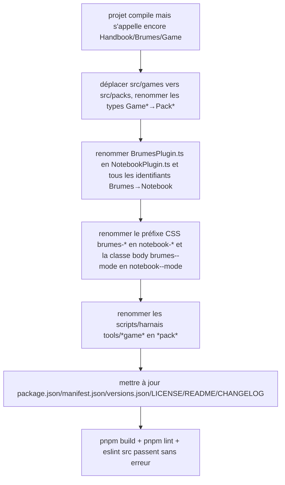

# Instruction: Renommage Brumes→Notebook / Game→Pack

## Architecture projection

> Tree de l'état final de cette phase. ✅ create · ✏️ modify · ❌ delete

```txt
notebook/
├── package.json                               ✏️ (name/description/keywords/version 0.1.0)
├── manifest.json                              ✏️ (id/name/description/authorUrl/version 0.1.0)
├── versions.json                              ✏️ (reset à {"0.1.0": "1.12.7"})
├── LICENSE                                    ✏️ (+ ligne copyright "Notebook")
├── README.md                                  ✏️ (réécriture : mécanisme générique, retrait sections jeu/Lantern)
├── CHANGELOG.md                               ✏️ (reset, entrée 0.1.0 + note de filiation)
├── src/
│   ├── main.ts                                ✏️ (import NotebookPlugin)
│   ├── BrumesPlugin.ts → NotebookPlugin.ts     ✏️ (renommage fichier + classe)
│   ├── contextMenu/index.ts                   ✏️ (registerBrumesContextMenu→registerNotebookContextMenu)
│   ├── settings/{index,types,calloutsModal,themeContentsModal}.ts ✏️ (identifiants Brumes→Notebook)
│   ├── features/
│   │   ├── blocks/{registry,shape,types}.ts   ✏️ (BrumesBlock→NotebookBlock, imports src/packs)
│   │   ├── callouts/{aliasSupport,commands,contextMenu,styleWriter,types}.ts ✏️ (imports src/packs, isValidGamePackId→isValidStylePackId)
│   │   ├── modes/{domModeClass,styleElement}.ts ✏️ (brumes--<mode> → notebook--<mode>)
│   │   └── noteBackground.ts                  ✏️
│   ├── games/ → packs/                        ✏️ (déplacement de dossier)
│   │   ├── assets.ts, capabilities.ts, customPacks.ts, fromSchema.ts,
│   │   │   overrides.ts, pluginManifest.ts, registry.ts, repositoryManifest.ts,
│   │   │   sourceInstaller.ts, sources.ts, starterKits.ts, storage.ts,
│   │   │   tokens.ts, types.ts, variants.ts   ✏️ (identifiants Game*→Pack*)
│   └── styles/{_fallbacks,_neutralize,_note-background}.scss ✏️ (préfixe brumes-*→notebook-*)
└── tools/
    ├── assert-game-storage.mjs → assert-pack-storage.mjs     ✏️
    ├── assert-game-variants.mjs → assert-pack-variants.mjs   ✏️
    ├── gameStorage.harness.mts → packStorage.harness.mts     ✏️
    ├── assertGameVariants.harness.mts → assertPackVariants.harness.mts ✏️
    ├── customPacks.harness.mts, assertStyleScope.harness.mts,
    │   assertNoteBackground.harness.mts, githubSources.harness.mts,
    │   repositoryManifest.harness.mts, sourceInstaller.harness.mts,
    │   starterKits.harness.mts, assert-reload-styles.mjs,
    │   assert-settings-ui.mjs                                ✏️ (références internes)
    └── (esbuild.config.mjs)                                  ✏️
```

## User Journey



## Tasks to do

### `1)` Déplacer `src/games/` vers `src/packs/` et renommer les types

> Aucun des 15 fichiers de `src/games/` n'a de nom de fichier contenant « game » — seul le dossier et les identifiants internes changent.

1. Déplacer le dossier `src/games/` vers `src/packs/` (tous les fichiers gardent leur nom : `assets.ts`, `capabilities.ts`, `customPacks.ts`, `fromSchema.ts`, `overrides.ts`, `pluginManifest.ts`, `registry.ts`, `repositoryManifest.ts`, `sourceInstaller.ts`, `sources.ts`, `starterKits.ts`, `storage.ts`, `tokens.ts`, `types.ts`, `variants.ts`).
2. Dans `types.ts` : `GameStyleTokens`→`StyleTokens`, `GameStyleLayer`→`StyleLayer`, `GameStyleValues`→`StyleValues`, `GamePolarity`→`StylePolarity`, `GAME_POLARITIES`→`STYLE_POLARITIES`, `isGamePolarity`→`isStylePolarity`, `GameFontFace`→`StyleFontFace`, `GameAssets`→`StyleAssets`, `GamePack`→`StylePack`, `isValidGamePackId`→`isValidStylePackId` (regex `GAME_PACK_ID_PATTERN` inchangée, renommer la constante en `STYLE_PACK_ID_PATTERN` par cohérence). `EMPTY_LAYER`/`EMPTY_STYLE` restent inchangés.
3. Dans `registry.ts` : `DECLARED_GAMES`→`DECLARED_PACKS`, `GameRegistration`→`PackRegistration`, `GAME_REGISTRATIONS`→`PACK_REGISTRATIONS`, `GAME_PACKS`→`STYLE_PACKS`, `initGameRegistry`→`initPackRegistry`, `gamePackClass`→`stylePackClass` (retourne `notebook--${id}`, cf. tâche 3), `gamePackClasses`→`stylePackClasses`, `gameVariantClasses`→`packVariantClasses`, `findGameRegistration`→`findPackRegistration`, `findGamePack`→`findStylePack`, `resolveGamePack`→`resolveStylePack`, `resolveGameRegistration`→`resolvePackRegistration`, `normalizeGameVariantId`→`normalizePackVariantId`, `DEFAULT_GAME_PACK_ID`→`DEFAULT_STYLE_PACK_ID`, `UNDRESSED_PACK` inchangé.
4. Dans `variants.ts` : `GameVariant`→`PackVariant`, `GameRegistration`→`PackRegistration` (si dupliqué avec registry.ts, garder une seule déclaration), `ResolvedGameAppearance`→`ResolvedPackAppearance`, `gameVariantClass`→`packVariantClass` (retourne `notebook--variant-${id}`), `findGameVariant`→`findPackVariant`.
5. Dans les 12 autres fichiers du dossier (`assets.ts`, `capabilities.ts`, `customPacks.ts`, `fromSchema.ts`, `overrides.ts`, `pluginManifest.ts`, `repositoryManifest.ts`, `sourceInstaller.ts`, `sources.ts`, `starterKits.ts`, `storage.ts`, `tokens.ts`) : mettre à jour tout identifiant important `Game*`/`Brumes*` restant et tout chemin d'import `../games/` en `../packs/` (ou chemin relatif équivalent après déplacement).
6. Mettre à jour tous les imports consommateurs listés dans la projection (`features/blocks/*`, `features/callouts/*`, `features/modes/*`, `features/noteBackground.ts`, `settings/*`, `contextMenu/index.ts`) pour pointer vers `../packs/...` et utiliser les nouveaux noms de types.

### `2)` Renommer `BrumesPlugin` en `NotebookPlugin`

1. Renommer le fichier `src/BrumesPlugin.ts` en `src/NotebookPlugin.ts` et la classe `BrumesPlugin` en `NotebookPlugin`.
2. Mettre à jour `src/main.ts` : `import NotebookPlugin from "./NotebookPlugin"; export default NotebookPlugin;`.
3. Renommer `SETTINGS_SAVE_LOG_MESSAGE`/`SETTINGS_SAVE_NOTICE` (ou équivalents) de « Handbook settings » à « Notebook settings ».
4. Grep `Brumes` dans tout `src/` après cette tâche : ne doit plus rester que des occurrences déjà prévues pour les tâches suivantes (CSS, settings).

### `3)` Renommer le préfixe CSS et la classe de mode

1. Dans `src/features/modes/domModeClass.ts` et `styleElement.ts` : `brumes--<mode>` → `notebook--<mode>` (classe posée sur le `body`). Dans le même fichier `domModeClass.ts` : `setBrumesMissingAssetClasses`→`setNotebookMissingAssetClasses` (fonction distincte du mode, appelée depuis `NotebookPlugin.ts` — mettre à jour l'import et l'appel à cet endroit aussi).
2. Dans `src/packs/assets.ts` (déplacé de `src/games/` à la tâche 1) : la chaîne de gabarit `` `brumes-missing--${role}` `` → `` `notebook-missing--${role}` ``.
3. Dans `src/styles/_fallbacks.scss` (après la tâche 1 de `phase-1.md`, ne contient plus que le commentaire d'en-tête documentant le mécanisme `brumes-missing--<role>`), `_neutralize.scss` (4 occurrences), `_note-background.scss` (6 occurrences) : préfixe `brumes-`/`brumes--` → `notebook-`/`notebook--` sur toutes les variables et classes CSS, y compris dans le commentaire d'en-tête de `_fallbacks.scss`. Dans ce même commentaire (et dans le commentaire équivalent de `src/features/blocks/shape.ts` autour de `setBrumesMissingAssetClasses`) : reformuler les emplois du mot anglais « game » (« a game declares its files », « belongs to a game ») en « pack », pour ne pas laisser survivre une occurrence de `\bgame\b` au grep final de la tâche 7.
4. Dans `src/packs/registry.ts`/`variants.ts` (tâche 1) : les fonctions `stylePackClass`/`packVariantClass` émettent bien `notebook--${id}` et `notebook--variant-${id}`.
5. Grep `brumes-` et `brumes--` dans `src/` : zéro occurrence restante hors commentaires historiques déjà couverts par la tâche 4.

### `4)` Contexte, réglages, callouts, blocks : identifiants restants

1. `src/contextMenu/index.ts` : `registerBrumesContextMenu`→`registerNotebookContextMenu`.
2. `src/settings/index.ts`, `types.ts`, `calloutsModal.ts`, `themeContentsModal.ts` : renommer `BrumesSettings`→`NotebookSettings`, `BrumesFeatureSettings`→`NotebookFeatureSettings`, `BrumesMode`→`PackMode` (ou `StylePackId` si le type n'est qu'un alias de `string`, vérifier avant de trancher), toute variable/paramètre `game`/`gamePack`→`pack`/`stylePack` dans ces fichiers. Le dropdown « Game mode » de `display()` devient « Style pack » et se construit depuis `STYLE_PACKS`.
3. `src/features/blocks/types.ts` : `BrumesBlock`→`NotebookBlock`, `BrumesFeatureSettings`/`BrumesMode`/`BrumesSettings` importés depuis `settings/types` renommés en conséquence, `isBlockEnabled`/`blockIds` inchangés.
4. `src/features/blocks/registry.ts`, `shape.ts` : mettre à jour les imports/identifiants `Brumes*`/`Game*` restants (types uniquement, pas de logique à changer). En particulier dans `registry.ts` : `BRUMES_BLOCKS`→`NOTEBOOK_BLOCKS`, `loadBrumesBlocks`→`loadNotebookBlocks` (import `BrumesPlugin`→`NotebookPlugin` déjà couvert par la tâche 2).
5. `src/features/callouts/{aliasSupport,commands,contextMenu,styleWriter,types}.ts` : `isValidGamePackId`→`isValidStylePackId` (import depuis `../../packs/types`), tout autre identifiant `Game*`/`Brumes*` restant.
6. `src/features/noteBackground.ts` : identifiants `Brumes*`/`Game*` restants.

### `5)` Renommer les scripts et harnais `tools/`

1. Renommer `tools/assert-game-storage.mjs`→`assert-pack-storage.mjs`, `tools/assert-game-variants.mjs`→`assert-pack-variants.mjs`, `tools/gameStorage.harness.mts`→`packStorage.harness.mts`, `tools/assertGameVariants.harness.mts`→`assertPackVariants.harness.mts`.
2. Dans `tools/packStorage.harness.mts` (ex-`gameStorage.harness.mts`, ex. `prepareGameStorage`→`preparePackStorage`), `tools/assertPackVariants.harness.mts` (ex-`assertGameVariants.harness.mts` : `GAME_PACKS`/`GAME_REGISTRATIONS`/`initGameRegistry`/`normalizeGameVariantId`/`resolveGameRegistration`/`resolveGameAppearance`→équivalents `Pack*`, `setBrumesVariantClass`/`clearBrumesModeClasses`→`setNotebookVariantClass`/`clearNotebookModeClasses`), `tools/customPacks.harness.mts`, `assertStyleScope.harness.mts`, `assertNoteBackground.harness.mts`, `githubSources.harness.mts`, `repositoryManifest.harness.mts`, `sourceInstaller.harness.mts`, `starterKits.harness.mts`, `assert-reload-styles.mjs`, `assert-settings-ui.mjs` : mettre à jour les imports vers `src/packs/...` et tout identifiant `Game*`/`Brumes*` référencé. (`tools/assertCorpus.harness.mts` et `tools/overrideRoundTrip.harness.mts` n'existent plus : supprimés par `phase-1.md` tâche 8.)
3. Dans `package.json`, renommer les clés de scripts `assert:game-storage`→`assert:pack-storage` et `assert:game-variants`→`assert:pack-variants` (pointant vers les fichiers renommés de la sous-tâche 1).
4. Dans `esbuild.config.mjs` : mettre à jour toute référence `Brumes`/`Handbook` (nom de bundle, bannière) vers `Notebook`.

### `6)` Identité du plugin et attribution

1. `package.json` : `name` → `obsidian-notebook`, `version` → `0.1.0`, `description` → décrivant Notebook (styles packs génériques, pas de jeu), `keywords` → retirer `city of mist`/`legend in the mist`/`adrenaline system`/`ttrpg`/`roleplaying`/`game`, remplacer par des mots-clés génériques (`notebook`, `pkm`, `productivity`, `callouts`, `style pack`).
2. `manifest.json` : `id` → `obsidian-notebook`, `name` → `Notebook`, `version` → `0.1.0`, `description` → équivalent à celle de `package.json`, `authorUrl` → laisser `https://github.com/RebelliousSmile/obsidian-handbook` en placeholder à remplacer manuellement si un dépôt `obsidian-notebook` existe déjà (sinon garder tel quel et le signaler dans le rapport de fin de phase), `author` inchangé.
3. `versions.json` : remplacer tout le contenu par `{"0.1.0": "1.12.7"}`.
4. `LICENSE` : ajouter une troisième ligne de copyright après celle de Handbook : `Copyright (c) 2026 François-Xavier Guillois (modifications, "Notebook")`. Garder les deux lignes précédentes (Brumes, Handbook) intactes — chaîne d'attribution MIT complète.
5. `README.md` : réécrire pour décrire Notebook (packs de style génériques, callouts, blocks, mécanisme d'installation de packs via `packs/<id>/pack.json` et sources GitHub, les deux packs natifs `gestion-projet`/`client-guide`). Retirer toute section spécifique à un jeu (City of Mist/Legend in the Mist/:Otherscape), toute la section Lantern, les notices de migration historiques propres à Handbook 2.7.0. Garder la section attribution (Brumes → Handbook → Notebook) et les instructions d'installation BRAT en remplaçant `RebelliousSmile/obsidian-handbook` par le nouveau dépôt (même placeholder qu'à la sous-tâche 2).
6. `CHANGELOG.md` : remplacer le contenu par une seule entrée `## 0.1.0` résumant le fork (« Fork de Handbook 2.8.6, retrait du contenu TTRPG, ajout des packs gestion-projet et client-guide ») précédée d'une ligne de filiation renvoyant vers l'historique complet de Handbook.

### `7)` Vérification

1. Grep insensible à la casse `brumes` et `\bgame\b`/`Game[A-Z]` dans `src/`, `tools/`, `package.json`, `manifest.json`, `esbuild.config.mjs` : aucune occurrence restante hors commentaires de filiation historique explicitement gardés (LICENSE, README attribution, CHANGELOG). Les tâches 1 à 6 énumèrent les occurrences connues mais ne sont pas garanties exhaustives : tant que ce grep renvoie une occurrence non couverte, la corriger directement (même règle `Brumes*`→`Notebook*`/`Game*`→`Pack*`/`game`→`pack`) et relancer le grep, jusqu'à zéro occurrence.
2. `pnpm build` passe.
3. `./node_modules/.bin/eslint src --ext .ts` et `pnpm lint` passent sans erreur.

## Test acceptance criteria

| Task | Acceptance criteria                                                                            |
| ---- | ------------------------------------------------------------------------------------------------- |
| 1    | `src/games/` n'existe plus, `src/packs/` contient les 15 fichiers avec les types renommés          |
| 2    | `src/BrumesPlugin.ts` n'existe plus, `src/NotebookPlugin.ts` exporte la classe `NotebookPlugin`    |
| 3    | Le body d'un vault de test porte la classe `notebook--gestion-projet` (ou id actif), plus jamais `brumes--*` |
| 4    | Aucun fichier sous `src/` ne référence `BrumesBlock`, `BrumesSettings`, `registerBrumesContextMenu` |
| 5    | `package.json` ne référence plus `assert:game-storage`/`assert:game-variants`, les fichiers renommés existent |
| 6    | `package.json`/`manifest.json` portent `obsidian-notebook`/`Notebook`/`0.1.0` ; `LICENSE` a 3 lignes de copyright |
| 7    | `pnpm build`, `./node_modules/.bin/eslint src --ext .ts`, `pnpm lint` passent tous sans erreur      |
