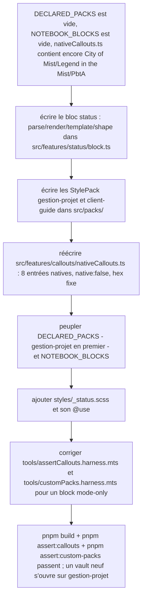

# Instruction: Packs natifs gestion-projet et client-guide

## Architecture projection

> Tree de l'état final de cette phase. ✅ create · ✏️ modify · ❌ delete
> Chemins post-phase-2 (`src/games/`→`src/packs/`, `Game*`→`Pack*`, `BrumesBlock`→`NotebookBlock`, `BRUMES_BLOCKS`→`NOTEBOOK_BLOCKS`).

```txt
notebook/
├── src/
│   ├── packs/
│   │   ├── gestionProjet.ts                   ✅ (StylePack "gestion-projet", polarities light+dark)
│   │   ├── clientGuide.ts                     ✅ (StylePack "client-guide", polarity light seule)
│   │   └── registry.ts                        ✏️ (DECLARED_PACKS peuplé : gestion-projet puis client-guide)
│   ├── features/
│   │   ├── callouts/
│   │   │   └── nativeCallouts.ts               ✏️ (réécriture complète : 8 entrées, plus aucun TTRPG)
│   │   ├── blocks/
│   │   │   └── registry.ts                     ✏️ (NOTEBOOK_BLOCKS = [statusBlock])
│   │   └── status/
│   │       └── block.ts                        ✅ (nouveau NotebookBlock<StatusBoardData>, mode: "gestion-projet")
│   └── styles/
│       ├── styles.scss                         ✏️ (+ `@use "status";`)
│       └── _status.scss                        ✅ (couleurs des 4 statuts todo/doing/done/blocked)
└── tools/
    ├── assertCallouts.harness.mts               ✏️ (bloc 1 générique ; bloc « style:pbta » supprimé)
    └── customPacks.harness.mts                  ✏️ (comparaison restreinte aux blocks à `capability`)
```

## User Journey



## Tasks to do

### `1)` Concevoir et implémenter le bloc `status` dans `src/features/status/block.ts`

> Le seul bloc non-kanban de suivi de statut prévu par le plan, activé uniquement sous le pack `gestion-projet` (activation par `mode`, pas par `capability` : ce n'est pas une capacité qu'un plugin externe pourrait fournir, c'est un bloc natif d'un pack natif). La règle de `shape.ts` (« zones are places, never states ») interdit une zone par statut : les 4 statuts (todo/doing/done/blocked) restent des classes posées sur chaque élément à l'intérieur d'une seule zone `items`, jamais des zones séparées.

1. Créer le type de données :
   ```ts
   export type StatusItemState = "todo" | "doing" | "done" | "blocked";

   export interface StatusBoardItem {
   	state: StatusItemState;
   	text: string;
   }

   export interface StatusBoardData {
   	title: string | null;
   	items: StatusBoardItem[];
   }
   ```
2. Définir la shape :
   ```ts
   export const statusBlockShape: BlockShape = {
   	block: "status",
   	root: "notebook-status",
   	zones: [
   		{ name: "title", holds: "le titre du suivi, quand la source en fournit un", optional: true },
   		{
   			name: "items",
   			holds:
   				"la liste des éléments suivis, chacun avec son statut porté par une classe sur l'élément (todo/doing/done/blocked), jamais par une zone séparée par statut",
   		},
   	],
   	gaps: [
   		"L'ordre des éléments suit strictement celui de la source ; un pack ne peut pas les trier par statut, seulement masquer une zone entière ou reformuler son intitulé.",
   	],
   };
   ```
3. Syntaxe source acceptée par `parse(source)` : une première ligne optionnelle qui ne commence pas par `- [` devient `title` ; chaque ligne suivante doit matcher `^-\s*\[( |~|x|X|!)\]\s*(.+)$` (` `→`todo`, `~`→`doing`, `x`/`X`→`done`, `!`→`blocked`) ou le parse échoue (retourne `null`, ce qui déclenche déjà le rendu générique « Invalid status block. » de `registry.ts`). Une liste d'éléments vide est valide (bloc juste créé). Exemple :
   ```
   Sprint 12
   - [ ] Rédiger le compte-rendu
   - [~] Corriger le bug de migration
   - [x] Déployer en préproduction
   - [!] Attendre la validation client
   ```
4. `render(data, doc)` construit un `<div>` portant `statusBlockShape.root`, puis appelle `renderZones(container, statusBlockShape, builders)` (import depuis `../blocks/shape`) avec :
   - `title` : retourne `null` si `data.title` est vide, sinon un `<div>` dont le texte est `data.title`.
   - `items` : un `<ul>` ; chaque `StatusBoardItem` devient un `<li>` avec `li.textContent = item.text` et `li.classList.add(\`notebook-status-item--${item.state}\`)`.
5. `template()` retourne le texte inséré par le menu contextuel :
   ```
   ```status
   Titre du suivi
   - [ ] Nouvelle tâche
   ```

   ```
   (le bloc `status` fermant, comme les autres blocks).
6. Exporter la constante `statusBlock: NotebookBlock<StatusBoardData>` avec `id: "status"`, `label: "Suivi de statut"`, `icon: "list-checks"`, `mode: "gestion-projet"`, `shape: statusBlockShape`, et les trois fonctions ci-dessus. Ne pas renseigner `capability`, `flag` ni `handout`.

### `2)` Écrire les deux `StylePack` dans `src/packs/`

> `gestion-projet` est le pack par défaut du vault (déclaré en premier, cf. tâche 4) et doit rester lisible dans les deux thèmes Obsidian ; `client-guide` cible des documents figés destinés à un client et n'a besoin que du thème clair.

1. `src/packs/gestionProjet.ts` :
   ```ts
   import { StylePack } from "./types";
   import { accent, tokens } from "./tokens";

   export const gestionProjetPack: StylePack = {
   	id: "gestion-projet",
   	label: "Gestion de projet",
   	polarities: ["light", "dark"],
   	style: {
   		base: { note: tokens(accent("#4c6ef5")), workspace: {} },
   		light: { note: tokens({ "--background-secondary": "#f3f5f9" }), workspace: {} },
   		dark: { note: tokens({ "--background-secondary": "#20242f" }), workspace: {} },
   	},
   };
   ```
2. `src/packs/clientGuide.ts` :
   ```ts
   import { StylePack, EMPTY_LAYER } from "./types";
   import { accent, tokens } from "./tokens";

   export const clientGuidePack: StylePack = {
   	id: "client-guide",
   	label: "Guide client",
   	polarities: ["light"],
   	style: {
   		base: { note: tokens(accent("#2f9e6e")), workspace: {} },
   		light: EMPTY_LAYER,
   		dark: EMPTY_LAYER,
   	},
   };
   ```
   `dark` est déclaré à `EMPTY_LAYER` (jamais lu, `polarities` ne cite pas `"dark"`) plutôt qu'omis : `GameStyleValues`/`StyleValues` exige les trois clés.
3. Ne pas renseigner `assets` ni `shapes` sur les deux packs (aucune police/illustration, aucun override de zone au lancement).

### `3)` Réécrire `src/features/callouts/nativeCallouts.ts`

> `styleWriter.ts::buildCalloutStyleCss()` saute toute entrée `native: true` (son style est censé vivre dans un `_callouts.scss` qui n'existe pas) et ne génère du CSS que pour `native: false`. Les 8 entrées natives des deux nouveaux packs doivent donc être déclarées `native: false` avec une couleur `fixed` pour bénéficier du CSS auto-généré, même si elles restent des entrées « catalogue » au sens de `migrateAliases.ts` (qui reste, lui, entièrement générique et ne dépend pas de la valeur de `native`).

1. Remplacer tout le contenu du fichier par :
   ```ts
   import { CalloutDefinition } from "./types";

   /**
    * Les 8 callouts natifs de gestion-projet et client-guide sont `native:
    * false` bien qu'ils soient du catalogue : c'est ce champ qui déclenche le
    * CSS auto-généré de `styleWriter.ts` (`native: true` suppose un partial
    * SCSS statique qui n'existe pas ici).
    */
   export const NATIVE_CALLOUTS: CalloutDefinition[] = [
   	{
   		id: "note", name: "Note", aliases: ["note"], scope: "gestion-projet",
   		template: "title-body", icon: "sticky-note", font: "header",
   		color: { kind: "fixed", hex: "#4c6ef5" }, native: false, styleKey: "note",
   	},
   	{
   		id: "warning", name: "Attention", aliases: ["warning"], scope: "gestion-projet",
   		template: "title-body", icon: "alert-triangle", font: "header",
   		color: { kind: "fixed", hex: "#d9822b" }, native: false, styleKey: "warning",
   	},
   	{
   		id: "tip", name: "Astuce", aliases: ["tip"], scope: "gestion-projet",
   		template: "title-body", icon: "lightbulb", font: "header",
   		color: { kind: "fixed", hex: "#3f9d6b" }, native: false, styleKey: "tip",
   	},
   	{
   		id: "question", name: "Question", aliases: ["question"], scope: "gestion-projet",
   		template: "title-body", icon: "help-circle", font: "header",
   		color: { kind: "fixed", hex: "#8b6fc9" }, native: false, styleKey: "question",
   	},
   	{
   		id: "important", name: "Important", aliases: ["important"], scope: "client-guide",
   		template: "title-body", icon: "alert-circle", font: "header",
   		color: { kind: "fixed", hex: "#c0392b" }, native: false, styleKey: "important",
   	},
   	{
   		id: "astuce", name: "Astuce", aliases: ["astuce"], scope: "client-guide",
   		template: "title-body", icon: "lightbulb", font: "header",
   		color: { kind: "fixed", hex: "#27965e" }, native: false, styleKey: "astuce",
   	},
   	{
   		id: "attention", name: "Attention", aliases: ["attention"], scope: "client-guide",
   		template: "title-body", icon: "alert-triangle", font: "header",
   		color: { kind: "fixed", hex: "#d68910" }, native: false, styleKey: "attention",
   	},
   	{
   		id: "a-faire-client", name: "À faire (client)", aliases: ["a-faire-client", "à-faire-client"], scope: "client-guide",
   		template: "title-body", icon: "list-todo", font: "header",
   		color: { kind: "fixed", hex: "#2f6fb0" }, native: false, styleKey: "a-faire-client",
   	},
   ];
   ```
2. `gestion-projet` reprend volontairement les 4 mots-clés que Obsidian reconnaît déjà nativement (`note`/`warning`/`tip`/`question`) comme alias, pour que `> [!note]` fonctionne sans nouvelle syntaxe à apprendre. `client-guide` introduit ses 4 mots-clés propres ; `a-faire-client` porte deux alias (ascii et accentué) tant que la prise en charge des caractères accentués par le moteur de callouts d'Obsidian n'est pas vérifiée manuellement — l'id/styleKey restent en ascii.
3. Confirmer par lecture que `normalizeCalloutEntry`/`NATIVE_TAKEN_IDS`/`generateCalloutId` dans `migrateAliases.ts` n'ont besoin d'aucune modification : ces fonctions sont déjà génériques et ne lisent jamais `native` pour leur propre logique.

### `4)` Peupler `DECLARED_PACKS` et `NOTEBOOK_BLOCKS`

> Trois chemins de code indépendants (`normalizeMode` dans `settings/types.ts`, `resolveStylePack`/`resolvePackRegistration` dans `packs/registry.ts`, et l'appel `PACK_REGISTRATIONS[0]?.pack.id` en dernier recours de `normalizeMode`) retombent tous sur le premier élément de `DECLARED_PACKS` dès qu'aucune valeur n'est sauvegardée. Déclarer `gestion-projet` en premier suffit, seul, à en faire le pack actif d'un vault neuf : aucune autre modification n'est nécessaire, en particulier pas `DEFAULT_SETTINGS.mode` (qui reste le sentinel `"none"`/`DEFAULT_STYLE_PACK_ID`, jamais atteint tant que `DECLARED_PACKS` n'est pas vide).

1. Dans `src/packs/registry.ts`, importer `gestionProjetPack` et `clientGuidePack`, et remplacer `DECLARED_PACKS: PackRegistration[] = []` par :
   ```ts
   export const DECLARED_PACKS: PackRegistration[] = [
   	{ pack: gestionProjetPack },
   	{ pack: clientGuidePack },
   ];
   ```
2. Ne toucher ni `DEFAULT_SETTINGS.mode` (`src/settings/types.ts`) ni `UNDRESSED_PACK`/`DEFAULT_STYLE_PACK_ID` (`src/packs/registry.ts`) : ce sont des filets de sécurité génériques, pas des valeurs à pointer vers `gestion-projet`.
3. Dans `src/features/blocks/registry.ts`, importer `statusBlock` depuis `../status/block` et remplacer `NOTEBOOK_BLOCKS: NotebookBlock<unknown>[] = []` par `[statusBlock]`.
4. Vérifier que `src/settings/index.ts` (sélecteur « Style pack », déjà généré depuis `STYLE_PACKS`) et `src/settings/themeContentsModal.ts` (déjà générique sur `NOTEBOOK_BLOCKS`) n'ont besoin d'aucune modification : les deux listent leurs éléments dynamiquement.

### `5)` Styliser les 4 statuts dans `src/styles/_status.scss`

> Un bloc n'a pas de CSS auto-généré comme un callout (`buildCalloutStyleCss` ne concerne que `CalloutDefinition`). Les 4 classes posées par `render()` (tâche 1) ont donc besoin d'un partial SCSS structurel, indépendant du pack actif — comme `_note-background.scss`/`_fallbacks.scss`, jamais scopé à `.notebook--<mode>`.

1. Créer `src/styles/_status.scss` avec une règle par statut sur `.notebook-status-item--todo/--doing/--done/--blocked` (couleur de texte ou pastille, à choix d'implémentation — pas de contrainte d'architecture ici).
2. Ajouter `@use "status";` dans `src/styles/styles.scss`, à côté des autres `@use` structurels.

### `6)` Corriger `tools/assertCallouts.harness.mts`

1. Bloc « Fresh vault... » (lignes ~11-24) : remplacer `assert.equal(migrated.native, true);` par une comparaison générique contre l'entrée native correspondante : `assert.equal(migrated.native, native.native);`.
2. Bloc « Portable callouts follow the manifest capability... » (lignes ~27-32, `NATIVE_CALLOUTS.filter(entry => entry.capability === "style:pbta")`) : supprimer entièrement — plus aucune entrée native ne porte `capability` après la tâche 3.
3. Bloc « Old shape with custom aliases... » (lignes ~34-60, `cityOfMist`/`legendInTheMist`) : si encore présent (il est censé avoir été supprimé par la tâche 7.9 de `phase-1.md`), le supprimer ici aussi — il référence des ids qui n'existent plus dans `NATIVE_CALLOUTS`.
4. Blocs restants (scope invalide, scope `"adrenaline"`, scope `"all"`, génération d'id avec `scope: "otherscape"`) : renommer les deux chaînes d'exemple résiduelles `"adrenaline"`→`"un-plugin-installe"` et `"otherscape"`→`"un-autre-plugin"` (ou toute chaîne neutre équivalente) — ce sont des exemples arbitraires de scope de plugin installé, sans lien avec le contenu supprimé, mais leur nom actuel est un résidu TTRPG cosmétique.
5. `pnpm assert:callouts` doit passer.

### `7)` Corriger `tools/customPacks.harness.mts` pour un block activé par `mode`

> Le bloc de test « The explicit catalogue must match the registered block ids » (lignes ~365-377) compare aujourd'hui *tous* les blocks de `NOTEBOOK_BLOCKS` aux capacités déclarées dans `GAME_PLUGIN_BLOCK_CAPABILITIES` — une hypothèse vraie par coïncidence tant que chaque block TTRPG s'activait par `capability`. Le bloc `status` s'active par `mode`, jamais par une capacité qu'un plugin externe pourrait fournir : il n'a ni ne doit avoir d'entrée dans `GAME_PLUGIN_BLOCK_CAPABILITIES`, et ne doit pas non plus subir le test « accepted for its declared activation » (qui simule un plugin externe déclarant cette capacité).

1. Restreindre la comparaison aux blocks à `capability` uniquement (`PACK_PLUGIN_BLOCK_CAPABILITIES`, nom post-phase-2 de `GAME_PLUGIN_BLOCK_CAPABILITIES` — cf. `phase-2.md` tâche 1.5) :
   ```ts
   const declared = [...PACK_PLUGIN_BLOCK_CAPABILITIES].sort();
   const registered = NOTEBOOK_BLOCKS
   	.filter((block) => block.capability !== undefined)
   	.map((block) => block.capability as string)
   	.sort();
   check("block capabilities match NOTEBOOK_BLOCKS", JSON.stringify(declared) === JSON.stringify(registered));
   ```
2. Restreindre la boucle qui suit (`for (const block of NOTEBOOK_BLOCKS) { ... }`, vérification « accepted for its declared activation », qui appelle `readPackPluginManifest` depuis `../src/packs/pluginManifest` — nom post-phase-2 de `readGamePluginManifest`) aux blocks à `capability` également (`if (!block.capability) continue;` en première ligne de la boucle) : un block `mode`-only n'a pas d'équivalent « plugin externe déclarant cette capacité » à tester.
3. `pnpm assert:custom-packs` doit passer, avec `NOTEBOOK_BLOCKS` contenant `statusBlock`.

### `8)` Vérification

1. Grep insensible à la casse `lantern|city-of-mist|legend-in-the-mist|otherscape|pbta|adrenaline` dans `src/` : aucune occurrence (le fichier `nativeCallouts.ts`, seule exception tolérée en fin de `phase-1.md`, ne doit plus en contenir aucune après la tâche 3).
2. `pnpm build` passe (y compris la compilation Sass avec le nouveau `_status.scss`).
3. `pnpm assert:callouts` et `pnpm assert:custom-packs` passent.
4. Ouvrir un vault neuf (pas de `data.json`) et vérifier que le body porte la classe `notebook--gestion-projet`, que le sélecteur « Style pack » des réglages liste « Gestion de projet » et « Guide client », et que le menu contextuel de l'éditeur propose « Suivi de statut ».

## Test acceptance criteria

| Task | Acceptance criteria                                                                                          |
| ---- | --------------------------------------------------------------------------------------------------------------- |
| 1    | `src/features/status/block.ts` exporte `statusBlock` ; `pnpm build` compile le fichier sans erreur de type     |
| 2    | `src/packs/gestionProjet.ts` et `src/packs/clientGuide.ts` exportent chacun un `StylePack` valide (`isValidStylePackId` accepte leur `id`) |
| 3    | `NATIVE_CALLOUTS` contient exactement 8 entrées, toutes `native: false`, scopées `gestion-projet`/`client-guide` (4 chacune) |
| 4    | `DECLARED_PACKS[0].pack.id === "gestion-projet"` ; `NOTEBOOK_BLOCKS` contient `statusBlock` ; un vault neuf s'ouvre avec `mode === "gestion-projet"` |
| 5    | `src/styles/_status.scss` existe et est `@use`d depuis `styles.scss` ; `pnpm build` compile le Sass sans erreur |
| 6    | `pnpm assert:callouts` passe ; le fichier ne contient plus `assert.equal(migrated.native, true)` ni de filtre `capability === "style:pbta"` |
| 7    | `pnpm assert:custom-packs` passe avec `NOTEBOOK_BLOCKS` non vide ; le check compare uniquement les blocks à `capability` |
| 8    | Grep `src/` sans occurrence TTRPG restante ; `pnpm build` termine sans erreur ; réglages et menu contextuel reflètent les deux nouveaux packs et le nouveau block |
