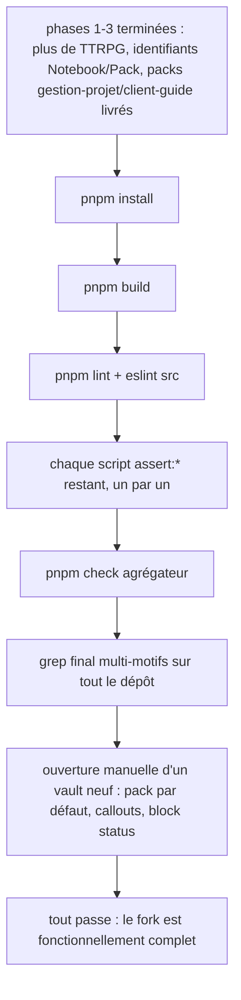

# Instruction: Vérification finale

## Architecture projection

> Cette phase ne crée, modifie ni supprime aucun fichier de production : elle exécute la suite complète de vérifications sur l'état livré par les phases 1 à 3, et corrige tout écart ponctuel qu'elle révèle (voir tâche 8).

```txt
notebook/                                       (aucun changement structurel attendu)
```

## User Journey



## Tasks to do

### `1)` Installer les dépendances et builder

> Dernière étape des phases 1 à 3 individuellement, mais jamais rejouée de bout en bout depuis un état propre — cette tâche vérifie que rien ne s'est cassé d'une phase à l'autre (ex. un renommage de la phase 2 qui aurait raté un import touché par la phase 3).

1. Lancer `pnpm install` : doit terminer sans erreur, sans warning de dépendance manquante.
2. Lancer `pnpm build` (`tsc -noEmit -skipLibCheck && esbuild`, ce dernier compilant `src/styles/styles.scss` via `sassPlugin`) : doit terminer sans erreur, TypeScript et Sass compris.

### `2)` Lint

1. Lancer `pnpm lint`.
2. Lancer `./node_modules/.bin/eslint src --ext .ts` (commande distincte utilisée par `phase-2.md` tâche 7, à rejouer ici pour confirmer qu'elle reste verte après la phase 3).
3. Les deux doivent terminer sans erreur.

### `3)` Rejouer tous les scripts `assert:*` restants

> Liste finale post-phases 1-3 (phase-1.md tâche 9.5 « garder tel quel », renommés par phase-2.md tâche 5.3) : `assert:pack-storage`, `assert:github-sources`, `assert:custom-packs`, `assert:repository-manifest`, `assert:source-installer`, `assert:starter-kits`, `assert:pack-variants`, `assert:settings-ui`, `assert:reload-styles`, `assert:style-scope`, `assert:callouts`, `assert:note-background`. `assert:corpus`, `dump:dom`, `assert:override` et tous les scripts spécifiques à un jeu (`assert:otherscape-*`, `assert:adrenaline-*`, `assert:pbta-*`, `assert:city-v1-theme`, `assert:mist-contract`, `assert:tag-widget`, `dev:schema-pbta`) ont été supprimés en phase 1 et ne doivent plus exister dans `package.json`.

1. Lancer chacun des 12 scripts listés ci-dessus individuellement (`pnpm assert:pack-storage`, etc.) : chacun doit terminer avec un code de sortie 0.
2. Lancer `pnpm e2e:request-url` si son exécution ne nécessite pas d'environnement Obsidian réel (vérifier par lecture du script avant de l'exécuter) ; sinon documenter dans le rapport de fin de phase pourquoi il a été sauté.
3. Confirmer que `pnpm assert:custom-packs` couvre bien `NOTEBOOK_BLOCKS` non vide (le check corrigé par `phase-3.md` tâche 7) et que `pnpm assert:callouts` couvre les 8 nouveaux callouts (corrigé par `phase-3.md` tâche 6).

### `4)` Rejouer le script agrégateur `pnpm check`

> `tools/check.mjs` (script `check`, conservé tel quel par `phase-1.md` tâche 9.5) rejoue dynamiquement `build`, `lint`, puis chaque script `assert:*` de `package.json` (hors un `Set` d'exclusion `externalSchemaAssertions`, vidé par `phase-2.md` tâche 7 puisque les scripts TTRPG qu'il visait sont supprimés). Aucune tâche ci-dessus ne le rejoue explicitement alors qu'il constitue la vérification agrégée de référence du dépôt.

1. Lancer `pnpm check` : doit terminer sans erreur et afficher `Notebook core check passed.` (chaîne renommée par `phase-2.md` tâche 7, plus `Handbook core check passed.`).
2. Si un échec apparaît alors que les tâches 1 à 3 ci-dessus sont vertes individuellement, c'est un signe que `externalSchemaAssertions` référence encore un script supprimé (ou un autre écart d'agrégation) : corriger `tools/check.mjs` et relancer.

### `5)` Grep final multi-motifs sur tout le dépôt

> Les grep de fin de phase 1 (`src/` uniquement) et de fin de phase 2 (`src/`, `tools/`, `package.json`, `manifest.json`, `esbuild.config.mjs`) étaient chacun scopés à leur propre périmètre de renommage. Cette tâche les rejoue réunis sur l'ensemble du dépôt pour rattraper tout fichier hors scope (ex. `README.md`, `CHANGELOG.md`, fichiers de config racine).

1. Grep insensible à la casse, sur tout le dépôt hors `node_modules/` et `.git/` : `lantern`, `city-of-mist`, `city of mist`, `legend-in-the-mist`, `legend in the mist`, `otherscape`, `pbta`, `adrenaline`, `brumes`, `\bgame\b`, `Game[A-Z]`, `game_` (motif requis en plus des deux précédents : une constante `SCREAMING_SNAKE_CASE` comme `GAME_PACKS` entoure « game » d'underscores, ce qui la rend invisible à `\bgame\b` — underscore compte comme caractère de mot — et à `Game[A-Z]` — underscore n'est pas dans `[A-Z]`).
2. Occurrences attendues et tolérées (à vérifier une par une, pas à exclure en bloc) : lignes d'attribution historique dans `LICENSE`, `README.md` (section attribution Brumes → Handbook → Notebook), `CHANGELOG.md` (ligne de filiation vers l'historique Handbook) — toutes introduites délibérément par `phase-2.md` tâche 6.
3. Toute autre occurrence est un résidu à corriger directement dans le fichier concerné, puis à revérifier par un nouveau grep.

### `6)` Vérification manuelle dans un vault Obsidian neuf

> Aucun des scripts `assert:*` n'ouvre réellement Obsidian ; cette tâche est la seule à valider l'expérience utilisateur finale du fork, notamment le comportement « pack actif par défaut » qui dépend de trois chemins de code convergents (`normalizeMode`, `resolveStylePack`, `PACK_REGISTRATIONS[0]`).

1. Builder le plugin (`pnpm build`) et le charger dans un vault Obsidian de test sans `data.json` préexistant (vault neuf ou dossier `.obsidian/plugins/obsidian-notebook/` copié dans un vault jetable).
2. Vérifier que le body porte la classe `notebook--gestion-projet` sans configuration manuelle.
3. Vérifier dans les réglages du plugin que le sélecteur « Style pack » liste « Gestion de projet » et « Guide client », et que passer de l'un à l'autre change bien le thème (et, pour client-guide, qu'aucun bouton de bascule clair/sombre n'apparaît puisque `polarities: ["light"]`).
4. Vérifier que le menu contextuel de l'éditeur propose les 4 callouts actifs du pack courant et, pour `gestion-projet`, le block « Suivi de statut » ; insérer un callout et un block de suivi, vérifier leur rendu visuel (couleur fixe, icône, statuts todo/doing/done/blocked visuellement distincts).
5. Vérifier qu'aucune icône, police ou illustration cassée n'apparaît (pas de `brumes-missing--*` visible).

### `7)` Nettoyage des fichiers de travail éventuels

1. Vérifier par `ls` qu'aucun fichier temporaire de brainstorm/planification n'a été laissé hors de `aidd_docs/tasks/2026_09/2026_09_15_notebook-fork/` (le dossier doit contenir exactement `plan.md`, `phase-1.md`, `phase-2.md`, `phase-3.md`, `phase-4.md`).

### `8)` Corriger tout écart révélé par les tâches 1 à 6

> Cette phase est la dernière ligne de défense : contrairement aux phases 1 à 3 qui anticipent des problèmes connus, celle-ci découvre ce qui a été manqué. Toute correction reste locale (le fichier concerné) et n'introduit aucun nouveau renommage global ni nouvelle fonctionnalité hors périmètre du plan.

1. Pour tout échec de build, lint, script `assert:*`, `pnpm check` ou grep résiduel détecté aux tâches 1 à 5 : corriger directement le fichier en cause.
2. Rejouer la tâche (build/lint/script/check/grep) concernée jusqu'à ce qu'elle passe.
3. Consigner dans le rapport de fin de phase toute correction effectuée ici, avec le fichier et la raison (utile pour un futur audit, même si `aidd_docs/` ne conserve pas de journal formel de session).

## Test acceptance criteria

| Task | Acceptance criteria                                                                                     |
| ---- | ------------------------------------------------------------------------------------------------------------ |
| 1    | `pnpm install` et `pnpm build` terminent tous deux sans erreur                                              |
| 2    | `pnpm lint` et `./node_modules/.bin/eslint src --ext .ts` terminent tous deux sans erreur                    |
| 3    | Les 12 scripts `assert:*` listés terminent tous avec un code de sortie 0 ; `assert:custom-packs` et `assert:callouts` couvrent bien les livrables de la phase 3 |
| 4    | `pnpm check` termine sans erreur et affiche `Notebook core check passed.`                                    |
| 5    | Le grep multi-motifs sur tout le dépôt ne renvoie que les occurrences d'attribution historique explicitement tolérées |
| 6    | Un vault neuf s'ouvre sur `notebook--gestion-projet`, les deux packs et le block « Suivi de statut » sont utilisables et visuellement corrects |
| 7    | `ls aidd_docs/tasks/2026_09/2026_09_15_notebook-fork/` ne contient que `plan.md`, `phase-1.md`, `phase-2.md`, `phase-3.md`, `phase-4.md` |
| 8    | Après corrections éventuelles, les tâches 1 à 5 repassent toutes au vert                                    |
