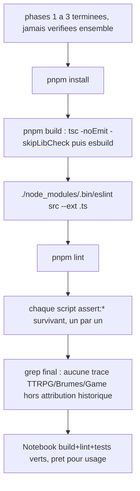

# Instruction: Vérification finale

## Architecture projection

> Phase de vérification pure : aucun fichier n'est créé, modifié ou supprimé. Elle constate que les phases 1 à 3 laissent le dépôt dans un état sain — build, lint et scripts `assert:*` survivants.

```txt
notebook/
└── (aucun changement — exécution de pnpm install / pnpm build / lint / assert:* uniquement)
```

## User Journey



## Tasks to do

### `1)` Installer et builder

1. `pnpm install` (dépendances TTRPG déjà retirées en phase 1, `package.json` déjà renommé en phase 2).
2. `pnpm build` (`tsc -noEmit -skipLibCheck && node esbuild.config.mjs production`) : doit passer sans erreur.

### `2)` Lint

1. `./node_modules/.bin/eslint src --ext .ts` : doit passer sans erreur.
2. `pnpm lint` (`eslint .`, périmètre plus large incluant `tools/`) : doit passer sans erreur.

### `3)` Scripts `assert:*` survivants

> Liste finale après suppression (phase 1, task 8) de `assert:corpus`/`dump:dom`/`assert:override`/`assert:tag-widget`/tous les scripts spécifiques à un jeu, et après renommage (phase 2, task 5) de `assert:game-storage`→`assert:pack-storage` et `assert:game-variants`→`assert:pack-variants`.

1. `pnpm assert:pack-storage`
2. `pnpm assert:github-sources`
3. `pnpm assert:custom-packs`
4. `pnpm assert:repository-manifest`
5. `pnpm assert:source-installer`
6. `pnpm assert:starter-kits`
7. `pnpm assert:pack-variants`
8. `pnpm assert:settings-ui`
9. `pnpm assert:reload-styles`
10. `pnpm assert:style-scope`
11. `pnpm assert:callouts`
12. `pnpm assert:note-background`

Chacun doit se terminer en succès (code de sortie 0).

### `4)` Grep de non-régression final

1. Grep insensible à la casse `city-of-mist|legend-in-the-mist|otherscape|adrenaline|pbta|lantern` dans `src/` et `tools/` : zéro occurrence.
2. Grep insensible à la casse `\bbrumes\b` dans `src/`, `tools/`, `package.json`, `manifest.json`, `esbuild.config.mjs` : zéro occurrence hors chaîne d'attribution historique de `LICENSE`/`README.md`/`CHANGELOG.md`.
3. Grep `\bgame\b|Game[A-Z]` dans `src/`, `tools/` : zéro occurrence (tout renommé `pack`/`Pack` en phase 2).

## Test acceptance criteria

| Task | Acceptance criteria                                                                 |
| ---- | ------------------------------------------------------------------------------------- |
| 1    | `pnpm install` et `pnpm build` terminent avec un code de sortie 0                     |
| 2    | `./node_modules/.bin/eslint src --ext .ts` et `pnpm lint` terminent avec un code de sortie 0 |
| 3    | Les 12 scripts `assert:*` listés terminent chacun avec un code de sortie 0            |
| 4    | Les 3 greps de la tâche 4 ne renvoient aucune occurrence inattendue                   |
